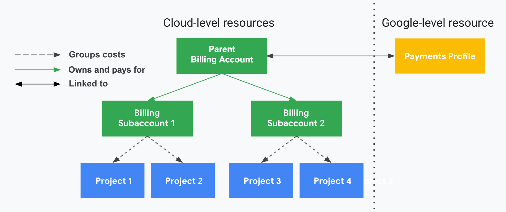
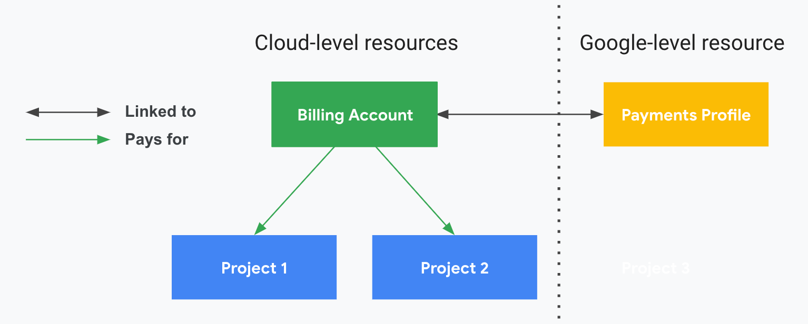
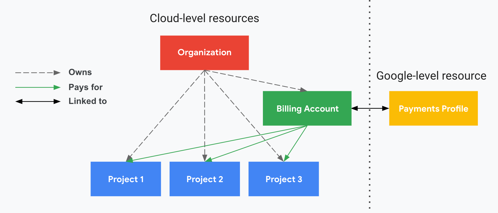

Organizations :
GET https://cloudbilling.googleapis.com/v1/{parent=organizations/*}/billingAccounts (https://cloud.google.com/billing/docs/reference/rest/v1/organizations.billingAccounts/list)
POST https://cloudbilling.googleapis.com/v1/{parent=organizations/*}/billingAccounts
  body (https://cloud.google.com/billing/docs/reference/rest/v1/billingAccounts#BillingAccount)

Projects : 
GET https://cloudbilling.googleapis.com/v1/{name=projects/*}/billingInfo (https://cloud.google.com/billing/docs/reference/rest/v1/projects/getBillingInfo)
PUT https://cloudbilling.googleapis.com/v1/{name=projects/*}/billingInfo (https://cloud.google.com/billing/docs/reference/rest/v1/projects/updateBillingInfo)
  BODY : https://cloud.google.com/billing/docs/reference/rest/v1/ProjectBillingInfo

Sub account :
GET https://cloudbilling.googleapis.com/v1/{parent=billingAccounts/*}/subAccounts (https://cloud.google.com/billing/docs/reference/rest/v1/billingAccounts.subAccounts/list)
  RESPONSE : https://cloud.google.com/billing/docs/reference/rest/v1/ListBillingAccountsResponse
    https://cloud.google.com/billing/docs/reference/rest/v1/billingAccounts#BillingAccount

List billing account by project
GET https://cloudbilling.googleapis.com/v1/{name=billingAccounts/*}/projects (https://cloud.google.com/billing/docs/reference/rest/v1/billingAccounts.projects/list)

List billing account :
GET https://cloudbilling.googleapis.com/v1/{name=billingAccounts/*} (https://cloud.google.com/billing/docs/reference/rest/v1/billingAccounts/get)
GET https://cloudbilling.googleapis.com/v1/billingAccounts (https://cloud.google.com/billing/docs/reference/rest/v1/billingAccounts/list)
Une billing account est lié à un profile de payment, un profile de payment quant à lui possède des factures.

Exemple global de comment fonctionne le billing chez France Nuage

